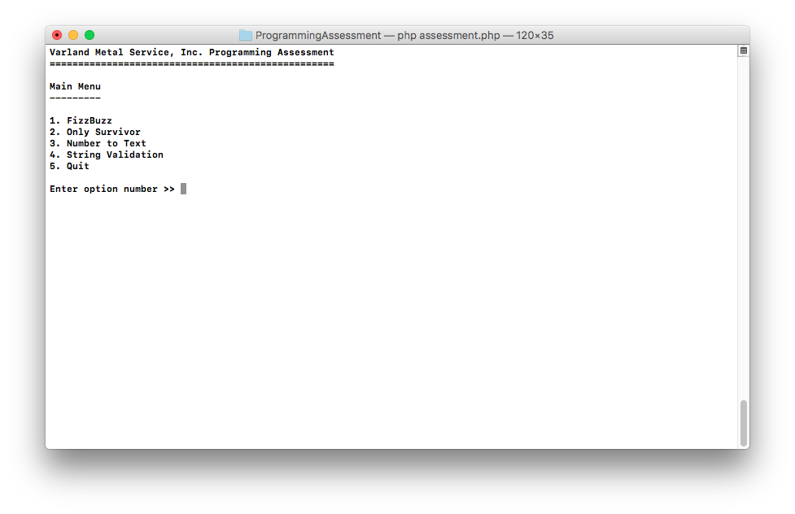
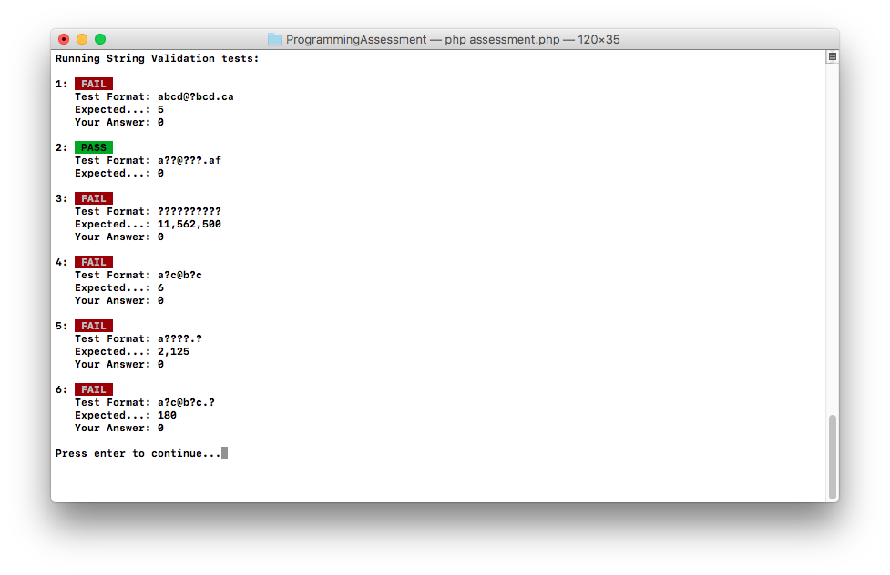

# Varland Metal Service Programming Assessment

Thank you for your interest in the programming/IT position at Varland Metal Service, Inc. This application will allow us to get a handle on some basic programming abilities in order to screen candidates for in-person interviews.

This assessment consists of four tasks. If you have questions or something isn't clear, feel free to get in touch with [Toby Varland](mailto:toby.varland@varland.com).

Once you submit your solution, Toby will follow up with you.

## Getting Started

To get started, download a copy of the [`assessment.php`](assessment.php) file. This file contains a command line PHP program that you can run on your computer as long as you have PHP 5 or later installed (simply run `php assessment.php` from the command line). If you cannot run the program, do not proceed without contacting Toby.

When you run the assessment program, you'll first see the main menu:



Before doing anything else, you can run through the options if you would like. None of the first four options are completely finished. When you run them, you'll see testing results:


For the first two options, every test will fail because part of this assessment is you writing these functions. For the third and fourth programs, some of the tests will pass and some will fail. These functions are partially written for you:



After taking a look around, go ahead and quit the program and bring up the `assessment.php` file in your favorite editor.

**Note: when you're running the assessment program, you can run through each test as many times as you want, but you must quit and relaunch the program each time you modify the `assessment.php` code.**

## Coding Tasks

### FizzBuzz

Your task is to complete the given FizzBuzz function. In the `VMS` class, you will find the following function defined:

```php
/**
 * Prints each number from 1..n on a separate line except in the following
 * cases:
 *
 * 1. If the number is divisible by 3, print "Fizz"
 * 2. If the number is divisible by 5, print "Buzz"
 * 3. If the number is divisible by 3 and 5, print "FizzBuzz"
 *
 * @param   int   $n    Upper limit of range of numbers to print.
 * @return  void
 */
protected static function fizzbuzz($n) {
}
```

As you can see, the function is empty and obviously won't do anything. Read the notes provided in the function comments and fill in this function so that it accomplishes the described task.

A few notes:

- Do not return a value from this function. As the function comments show, this function should not return a value. Instead, use the PHP `echo` command to output each number.
- It's okay to have an "extra" newline character at the end of your output.

When you're done, you can either continue to the next step or re-run the assessment program to test your results. If your function is correct, you should see that you pass the test.

### Only Survivor

Your next task is to complete the given onlySurvivor function. In the `VMS` class, you will find the following function defined:

```php
/**
 * Determine the winner of a game where each player knocks out the next player
 * in line until only one survivor remains. When the end of the line is reached,
 * the game loops around (so it's possible for the last player in line to knock
 * out the first player).
 *
 * Consider the example with 9 players:
 *
 *     1 knocks out 2
 *     3 knocks out 4
 *     5 knocks out 6
 *     7 knocks out 8
 *     9 knocks out 1
 *     3 knocks out 5
 *     7 knocks out 9
 *     3 knocks out 7
 *
 *     3 is the winner (and the return value for the function)
 *
 * @param   int   $players    Number of players who start the game.
 * @return  int
 */
protected static function onlySurvivor($players) {
}
```

Again the function is empty and obviously won't do anything. Read the notes provided in the function comments and fill in this function so that it accomplishes the described task.

When you're done, you can either continue to the next step or re-run the assessment program to test your results. If your function is correct, you should see that you pass the tests.

### Number to Text

This task is a little bit different. The `VMS::numberToText` function is written and will return a value, but as you can see in the assessment program, the return value isn't always correct.

When you dig into the code, you'll notice that `VMS::numberToText` calls `VMS::threeDigitNumberToText`. There is at least one problem in each of these functions. The problems are minor, but must be fixed nonetheless.

Your task is to ensure the `VMS::numberToText` functions always returns the correct value for each number from 1 to 999,999,999,999,999. You may fix the mistakes in the functions I wrote or start from scratch. Be careful about starting from scratch, though. If you go that route, I expect your code to be demonstrably better than my code you're throwing away. No pressure.

When you're done, you can either continue to the next step or re-run the assessment program to test your results. If your function is correct, you should see that you pass the tests.

### String Validation

You're almost done. Just one more little thing… My `countValidStrings` function doesn't work. The function comments describe what constitutes a valid string. To recap, for a string to be valid it must:

1. Start with one or more groups of characters (`a`..`e` are the only valid characters) separated by a period,
2. Contain exactly one `@` after the opening group(s) of characters, and
3. End with two or more groups of characters (again, `a`..`e` only) separated by a period after the `@`.

As you can probably tell, valid strings will closely resemble email addresses.

For example,

- `"a@b.e"`
- `"abcde.edcba@a.b.c.d.e"`

are valid strings, while those listed below are not:

- `"@a.a"` (no non-empty groups of lowercase letters before `'@'`)
- `"a@a"` (only one non-empty group of lowercase letters after `'@'`)
- `"a.b@c.d@e.e"` (more than one `'@'` character)
- `"aa..aa@a.a"` (no lowercase letters between two consecutive `'.'`s)
- `"abc@d.e.f"` (`'f'` does not belong to the range [`'a'`..`'e'`])
- `"abc.@a.a"` (no letters between `'.'` and `'@'`)
- `"abc@a.a."` (no letters after the last `'.'`)

Example

For `$format = "abcd@?bcd.ca"`, the output should be
`countValidStrings($format) = 5`. The format given to the function may contain any number of `?` wildcard characters.

The valid strings that may be obtained from this format are:

- `"abcd@abcd.ca"`
- `"abcd@bbcd.ca"`
- `"abcd@cbcd.ca"`
- `"abcd@dbcd.ca"`
- `"abcd@ebcd.ca"`

My function takes care of all the possible permutations for the given format. So you don't need to worry about the number of wildcard characters or anything like that. The only part I didn't finish is coming up with a regular expression to determine if a given string is valid:

```php
// Store regex for determining whether given string is valid.
$regex = '/^$/';
```

Complete the regular expression so that the function returns the correct result in all cases. I use [this website](http://regex101.com) to help me create regular expressions, but you probably don't need that.

When you're done, re-run the assessment program to test your results. If your regular expression is correct, you should see that you pass the tests. At this point, you should be able to run all the functions in the assessment program and pass all the tests. Once that's the case, submit your completed program to [Toby Varland](mailto:toby.varland@varland.com) and he'll follow up with you.
